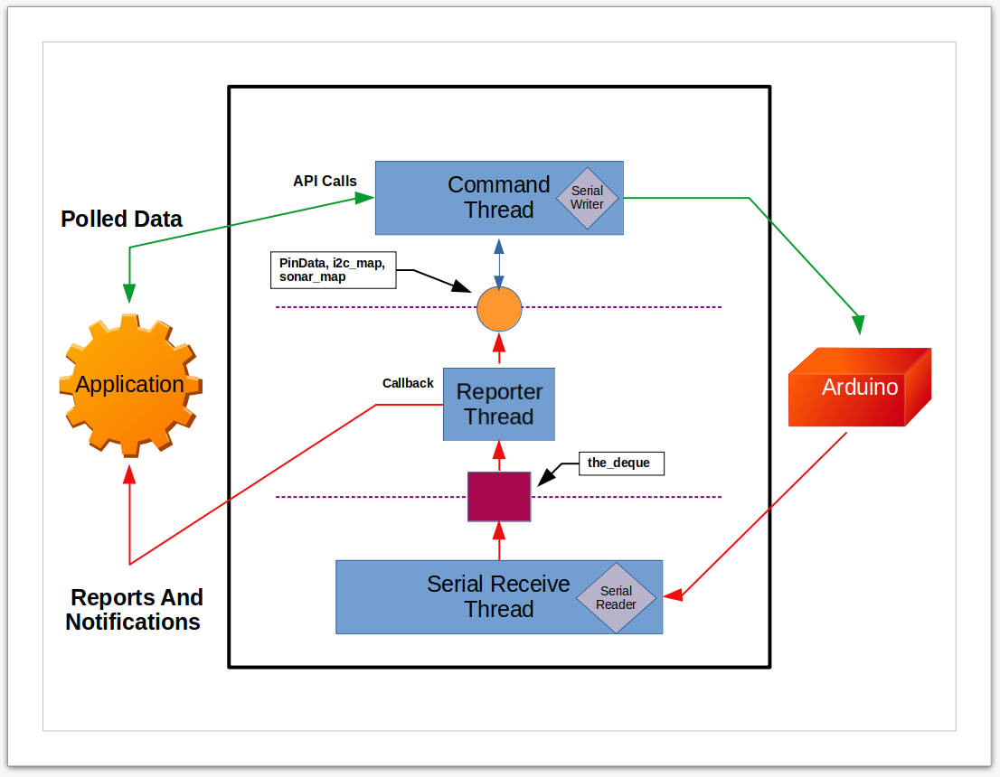

# The Concurrency Model

## Introduction
In this section, we discuss the concurrency model used by pymata4.

According to [Wikipedia,](https://en.wikipedia.org/wiki/Concurrency_(computer_science)) 
*"concurrency is the ability of different parts or units of a program, algorithm, or 
problem to be executed out-of-order or in partial order, without affecting the final outcome. 
This allows for parallel execution of the concurrent units, which can significantly 
improve overall speed of the execution in multi-processor and multi-core systems."*

To assure the best possible performance, pymata4 needs to do the following tasks, all at the same time:

* Accept and process API calls from the application.
    * Translate the API calls into Firmata formatted messages.
    * Transmit these messages across the serial link.
* Continuously receive data from the serial link.
    * Assure no data loss
* Decode the received data.
    * Store information in the pymata4 internal data structures.
    * Notify the application of data change notifications by calling the user-provided callback methods.

To accomplish all this, pymata4 uses the Python [threading](https://docs.python.org/3.8/library/threading.html) 
module. It breaks its tasks into three
main threads, the *Command Thread*, the *Reporter Thread*, and the *Serial Data Reciever Thread*. 

The concurrency model is depicted in the diagram below. The three threads, including the data structures used to 
provide for inter-thread communication, are contained in the rectangle with the solid border.
This rectangle constitutes the pymata4 package.

The user application is depicted on the left side of the diagram, and the Arduino containing the
Firmata sketch is shown on the right.

 
 

Copyright (C) 2020 Alan Yorinks. All Rights Reserved.
