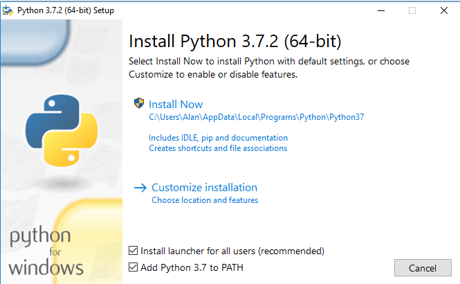

## INSTALLING PYTHON 3.7 OR GREATER
### Windows Users

To install Python 3.x, go to the
<a href="https://www.python.org/" target="_blank">Python home page,</a>
and download the latest Python 3 distribution for your operating system.

During the installation process, if there is a checkbox to add Python 3.x to your path,
 make sure it is checked before proceeding with the installation.



### Linux Users

#### Raspberry Pi Raspbian Users
If your copy of Raspbian is using Python 3.7 or greater, you should be all set to proceed.

#### Ubuntu and Other Debian Based Linux Distributions

You may need to install pip3. To check, open a terminal and type:
```python
which pip3
```
If a path to pip3 is not reported, you will need to install it.

Open a terminal window and type:
```
  sudo apt-get install pip3-python
```

You should then make sure you have the latest version by typing:
```python
sudo pip3 install -U pip
```

#### For All Other Linux Distributions

Refer to your distribution's instructions.

### Mac Users
1. Install Python 3.7.x from [https://www.python.org/downloads/](https://www.python.org/downloads/)
 or via [homebrew](http://brew.sh/)
2. Download get-pip.py from [https://bootstrap.pypa.io/get-pip.py](https://bootstrap.pypa.io/get-pip.py) and
install (this should already be installed if python was installed from python.org or homebrew):

```
curl -O https://bootstrap.pypa.io/get-pip.py
sudo python3 get-pip.py
```


### Verify The Python Installation

Use the [procedure shown here](https://mryslab.github.io/pymata4/python_3_7.install/#verifying-the-python-version-on-your-computer) to verify that you have successfully
installed Python 3.7 on your
computer.
<br>
<br>


Copyright (C) 2020 Alan Yorinks. All Rights Reserved.

